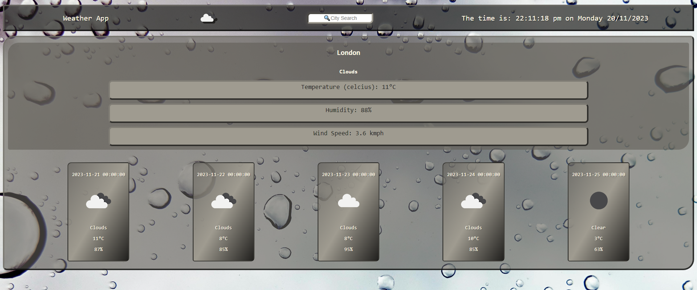
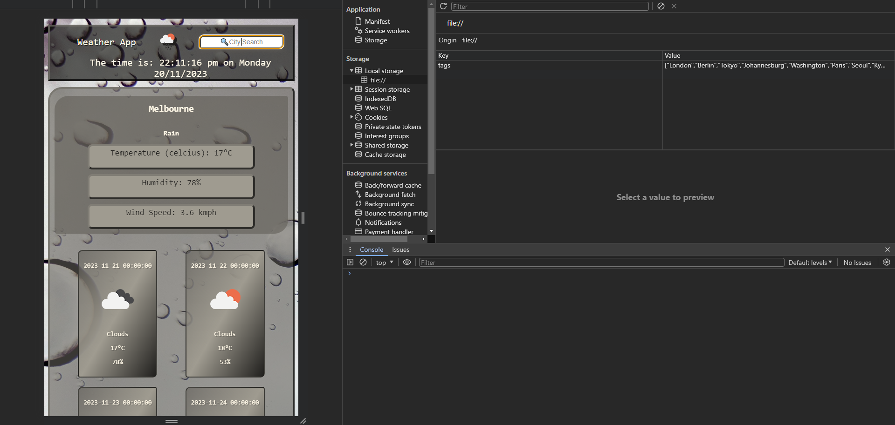

# Weather App

This project is designed to take a user input and display weather data for different cities around the world using the OpenWeather API.

When a user searches for a city they are presented with present and future forecasts, the search will then be added to the search history. The search history should be saved in local storage, with the option to delete the search history.

When a user views weather for a city they are presented with the city name, current date, an icon displaying the weather conditions with text for the temperature humidity and wind speed.

When a user views future forecasts they are presented with a display for the same data above, minus humidity but set at that dates forecast.

> Full screen view of application

> Mobile resolution and local storage screenshot

## Front End

- HTML
- CSS
- JavaScript
- jQuery
- dayJS

## Usage

Deployed Link: https://jaycossey.github.io/weather-app/

## Support

For support please contact me via: https://github.com/Jaycossey

## License

MIT: See License for details.